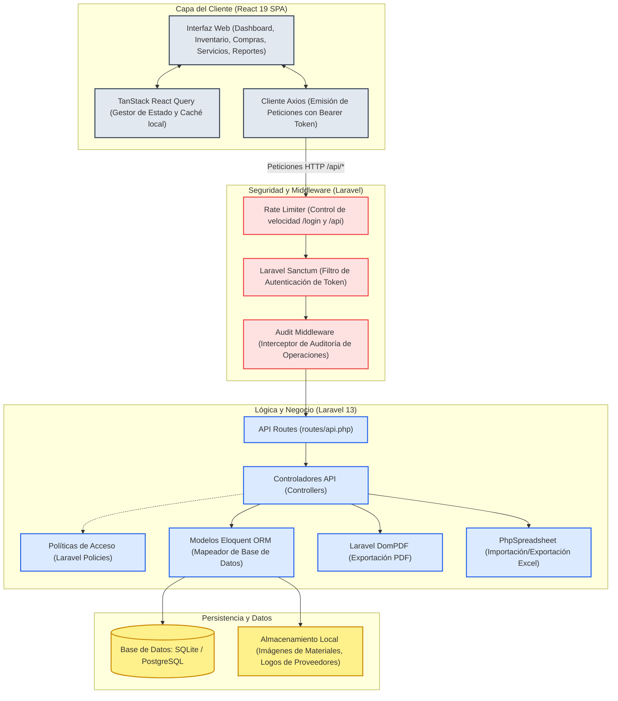
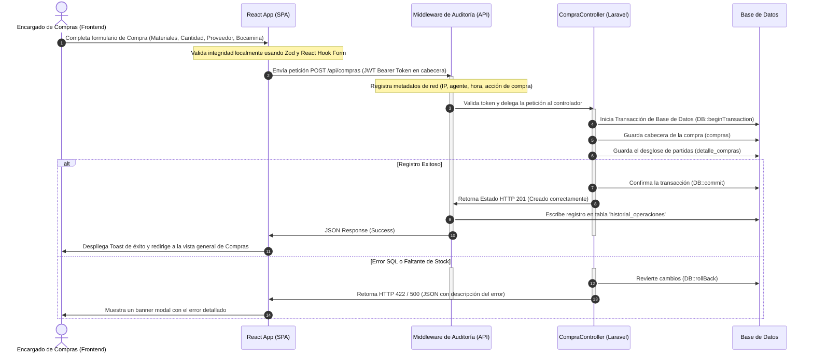

# 🏔️ Funcionamiento del Sistema e Infografía de Arquitectura

Este archivo describe detalladamente el funcionamiento del sistema, la distribución de sus módulos, las herramientas utilizadas y el flujo operativo general de la plataforma de control de compras de la cooperativa minera.

---

## 🏗️ Diagrama General de Arquitectura

El sistema está desarrollado bajo un modelo de cliente-servidor desacoplado (Decoupled Architecture), donde la interfaz de usuario web interactúa exclusivamente mediante peticiones RESTful seguras con el servidor backend.



---

## 🛠️ Herramientas Utilizadas (Tech Stack)

### **1. Frontend (SPA)**
*   **React 19 & TypeScript:** Framework reactivo de UI y tipado estático seguro para evitar errores en producción.
*   **Vite 8:** Herramienta de compilación ultrarrápida y servidor de desarrollo.
*   **Tailwind CSS v3:** Estilado premium responsivo bajo una paleta oscura y metalizada basada en la temática de minería.
*   **Framer Motion v12 & Anime.js v3:** Librerías de animación encargadas de dar fluidez en transiciones de páginas y efectos hover de botones/tarjetas.
*   **TanStack React Query v5:** Administrador de peticiones asíncronas y caché automático para optimizar el consumo de la API.
*   **React Router DOM v7:** Motor de enrutamiento y control de accesos privados de usuario.
*   **React Hook Form v7 & Zod v4:** Controladores de formularios interactivos y validadores de esquemas estrictos antes del envío de datos.
*   **Recharts v3:** Gráficos estadísticos interactivos para los paneles de gastos e inventarios.

### **2. Backend (API RESTful)**
*   **PHP 8.3 & Laravel 13:** Base sólida del backend con soporte de rutas API y componentes modulares.
*   **Laravel Sanctum:** Mecanismo de autenticación simplificado mediante tokens API en cabecera HTTP (`Authorization: Bearer <token>`).
*   **Laravel DomPDF:** Renderizador HTML a PDF usado para exportar recibos e historiales de compras.
*   **PhpSpreadsheet:** Biblioteca encargada de generar reportes en Microsoft Excel e importar grandes catálogos de materiales mineros.
*   **PHPUnit 12:** Framework de pruebas para verificar la integridad lógica y la seguridad de los controladores.

---

## 🗂️ Módulos Principales del Sistema

### **🔑 Módulo de Autenticación y Seguridad (RBAC)**
*   **Frontend:** [control-compras-frontend/src/features/auth](file:///c:/Users/User2/Downloads/EMPRESA%20MINERA/control-compras-frontend/src/features/auth) - Provee las pantallas de inicio de sesión y la envoltura contextual (`AuthContext.tsx`) que evalúa en tiempo real si el usuario actual tiene permisos para acceder a ciertas vistas o realizar acciones de escritura.
*   **Backend:** [AuthController.php](file:///c:/Users/User2/Downloads/EMPRESA%20MINERA/control-compras-backend/app/Http/Controllers/Api/AuthController.php) - Procesa la validación de credenciales bajo límites de intentos (`throttle:login`) para prevenir ataques de fuerza bruta.

### **🛒 Módulo de Control de Compras**
*   **Frontend:** [control-compras-frontend/src/features/compras](file:///c:/Users/User2/Downloads/EMPRESA%20MINERA/control-compras-frontend/src/features/compras) - Contiene el formulario inteligente de registro de órdenes de compras con selección interactiva de proveedores, bocaminas de destino y autocompletado de precios/materiales.
*   **Backend:** [CompraController.php](file:///c:/Users/User2/Downloads/EMPRESA%20MINERA/control-compras-backend/app/Http/Controllers/Api/CompraController.php) - Administra la inserción atómica de la cabecera y el detalle de compras dentro de transacciones SQL para asegurar la consistencia.

### **📦 Módulo de Catálogo e Inventario**
*   **Frontend:** [control-compras-frontend/src/features/inventario](file:///c:/Users/User2/Downloads/EMPRESA%20MINERA/control-compras-frontend/src/features/inventario) - Buscador dinámico de materiales por código, descripción o categoría, permitiendo a los gestores añadir fotos reales y ajustar precios.
*   **Backend:** [MaterialController.php](file:///c:/Users/User2/Downloads/EMPRESA%20MINERA/control-compras-backend/app/Http/Controllers/Api/MaterialController.php) - CRUD de materiales e integración con almacenamiento local para carga y eliminación de imágenes de repuestos.

### **🔧 Módulo de Mantenimiento, Servicios e Inspección de Flota**
*   **Frontend:** [control-compras-frontend/src/features/servicios](file:///c:/Users/User2/Downloads/EMPRESA%20MINERA/control-compras-frontend/src/features/servicios) - Dashboard centralizado para rastrear el ciclo de vida de la maquinaria, grúas y vehículos:
    *   **Maquinarias y Vehículos:** CRUD de flota de transporte y excavación.
    *   **Servicios/Mantenimientos:** Registro de órdenes correctivas o preventivas y consumo de repuestos.
    *   **Inspecciones:** Checklists técnicos de seguridad obligatorios antes de ingresar a los frentes de trabajo mineros.
    *   **Alquiler de Grúas:** Control de gastos de maquinaria alquilada externamente.
*   **Backend:** Controladores independientes protegidos con políticas de autorización (`MaquinariaController`, `VehiculosController`, `ServiciosController`, `InspeccionController`).

### **📊 Módulo de Reportes y Dashboards Financieros**
*   **Frontend:** [control-compras-frontend/src/features/reportes](file:///c:/Users/User2/Downloads/EMPRESA%20MINERA/control-compras-frontend/src/features/reportes) y [dashboard](file:///c:/Users/User2/Downloads/EMPRESA%20MINERA/control-compras-frontend/src/features/dashboard) - Dashboard interactivo con gráficos comparativos de barras y líneas que muestran la distribución mensual de egresos y costos acumulados por bocamina.
*   **Backend:** [ReporteController.php](file:///c:/Users/User2/Downloads/EMPRESA%20MINERA/control-compras-backend/app/Http/Controllers/Api/ReporteController.php) - Ejecución de consultas de agrupación y sumatorias financieras rápidas, con endpoints específicos para compilar descargas en PDF y planillas Excel de reportes generales.

### **🛡️ Módulo de Auditoría y Administración de Roles**
*   **Frontend:** [control-compras-frontend/src/features/admin](file:///c:/Users/User2/Downloads/EMPRESA%20MINERA/control-compras-frontend/src/features/admin) - Permite al rol administrador ver las trazas de actividades de otros usuarios en tiempo real, configurar cuentas, roles (Administrador, Gerencia, Compras, Contabilidad) y actualizar ubicaciones de bocaminas.
*   **Backend:** Gestión integrada mediante `UsuarioController` y un middleware personalizado (`AuditMiddleware`) que registra de forma transparente en la tabla `historial_operaciones` cualquier inserción, modificación o eliminación.

---

## 🔄 Flujo Operativo Principal: Ciclo de una Compra

Este diagrama de secuencia ilustra el proceso completo desde que un encargado de compras realiza un pedido en el frontend hasta que se audita e impacta la base de datos de la empresa:



---

## 🌐 Guía para Despliegue en Hosting / Producción

Esta sección contiene las instrucciones paso a paso que debe seguir el encargado de infraestructura o hosting para publicar el sistema en producción.

### 📦 Archivos Incluidos en el Proyecto para Despliegue
1. **Volcado Completo de Base de Datos**: `base_de_datos_produccion.sql` (Ubicado en la raíz del proyecto). Contiene el esquema completo de PostgreSQL y todos los datos iniciales y reales cargados.
2. **Respaldo Completo ZIP (BD + Imágenes)**: `control-compras-backend/storage/app/respaldos/backup_2026-07-19_20-40-07.zip`.
3. **Frontend Compilado**: `control-compras-frontend/dist/` listo para publicar.

---

### ⚙️ Requisitos del Servidor (Hosting / VPS)
- **Servidor Web**: Nginx o Apache con certificado SSL (HTTPS).
- **Base de Datos**: PostgreSQL 13 o superior con la extensión `pg_trgm` (`CREATE EXTENSION IF NOT EXISTS pg_trgm;`).
- **PHP**: Versión 8.2 o superior (`pdo_pgsql`, `pgsql`, `mbstring`, `gd`, `dom`, `xml`, `zip`).
- **Acceso SSH**: Para ejecutar comandos de mantenimiento.

---

### 🚀 Pasos de Despliegue Backend (Laravel API)

1. Subir la carpeta `control-compras-backend` al servidor.
2. Importar el archivo `base_de_datos_produccion.sql` en la base de datos PostgreSQL de producción.
3. Crear y configurar el archivo `.env` en la raíz del backend con los datos de producción:
   ```ini
   APP_NAME="Empresa Minera"
   APP_ENV=production
   APP_DEBUG=false
   APP_URL=https://api.tudominio.com
   FRONTEND_URL=https://tudominio.com
   SANCTUM_STATEFUL_DOMAINS=tudominio.com,api.tudominio.com
   SESSION_DOMAIN=.tudominio.com
   APP_TIMEZONE=America/La_Paz

   DB_CONNECTION=pgsql
   DB_HOST=127.0.0.1
   DB_PORT=5432
   DB_DATABASE=nombre_bd_prod
   DB_USERNAME=usuario_bd_prod
   DB_PASSWORD=contrasena_segura
   ```
4. Ejecutar los siguientes comandos en la terminal del servidor (SSH):
   ```bash
   composer install --optimize-autoloader --no-dev
   php artisan storage:link
   php artisan config:cache
   php artisan route:cache
   php artisan view:cache
   chmod -R 775 storage bootstrap/cache
   ```

---

### 🎨 Pasos de Despliegue Frontend (React / Vite)

1. Subir **todo el contenido de la carpeta `control-compras-frontend/dist/`** a la raíz pública del servidor (ej. `public_html`).
2. Configurar el archivo `.htaccess` en `public_html` (si usas Apache) para evitar errores 404 al navegar o recargar páginas:
   ```apache
   <IfModule mod_rewrite.c>
     RewriteEngine On
     RewriteBase /
     RewriteRule ^index\.html$ - [L]
     RewriteCond %{REQUEST_FILENAME} !-f
     RewriteCond %{REQUEST_FILENAME} !-d
     RewriteRule . /index.html [L]
   </IfModule>
   ```
   *(Si el servidor es Nginx, agregar en el bloque de servidor: `location / { try_files $uri $uri/ /index.html; }`).*

